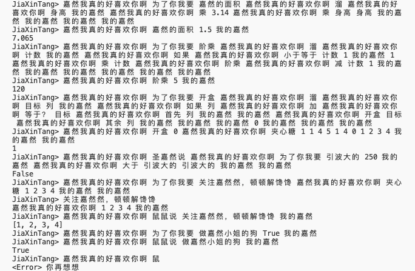

# JiaXinTang
JiaXinTang Parser. 嘉然小姐和她的夹心糖们。
请关注我们的主，至高无上的[圣嘉然](https://space.bilibili.com/672328094)。


A funny toy implemented in Python3.

Use `嘉然我真的好喜欢你啊` `我的嘉然` as start and end.

You can use this to make some simple calculations, but if there is something went wrong...
```
JiaXinTang> 嘉然我真的好喜欢    
<Error> 你再想想
```

More examples:

 

